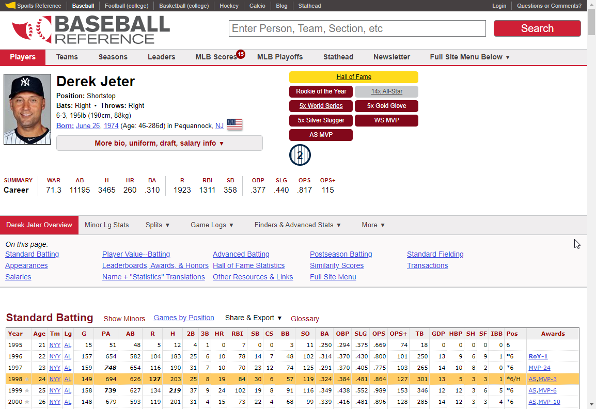
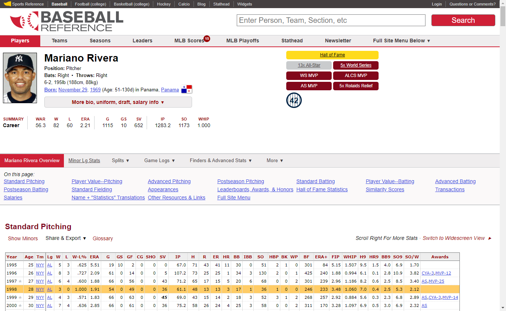

# Data sources

Our data sources are www.baseball-reference.com for the real-life statistics and approximately 100 games of scoresheets from APBA Baseball.

In order to extract the data needed from [Baseball Reference](https://www.baseball-reference.com), we performed web scraping to pull the batting and pitching data in the year 1998 for the players that appear in the 100 games of APBA Baseball.

```{r}

# We load in the appropriate packages and proceed to retrieve the data.

library(tidyverse) # for working with data frames
library(robotstxt) # for checking if we are allowed to scrape the website
library(rvest)     # for web scraping
library(stringr)   # for string manipulations
```

First, we check if it is allowed to scrape the [Baseball Reference](https://www.baseball-reference.com) website using the `robotstxt` package.

```{r echo=TRUE}
paths_allowed('https://www.baseball-reference.com')
```

## Batting Table

In order to obtain the real-life batting statistics for each individual player, we choose to scrape the **Standard Batting** table on the Baseball Reference website for each individual player. The entire list of players can be found in [this folder](https://github.com/zichenghuang/baseball-board-game/tree/main/data/players_list). For example, the batting stats for Derek Jeter can be found at [this link](https://www.baseball-reference.com/players/j/jeterde01.shtml). Since we only want data for 1998 season, the row of Year 1998 in the **Standard Batting** table is our target.



Using the `rvest` package, we can locate this particular row of data with `html_nodes()` by passing the condition `xpath = '//*[@id="batting_standard.1998"]/td'`. The column names are stored in the `html_attr('data-stat')`, and the row values can be extracted using `html_text()`. 


```{r, eval=FALSE}

## obtain batting data for players who only do batting

players_batting <- read_csv('data/players_list/players_batting_only.csv')

n <- nrow(players_batting)

df_batting_only = data.frame()

for (i in 1:n){
  url <- paste('https://www.baseball-reference.com/players/',
               substr(players_batting$playerID[i], 1, 1),
               '/',
               players_batting$playerID[i],
               '.shtml',
               sep = '')
  
  # paths_allowed(url)
  
## creating variables  
  
  web <- read_html(url)
  
  name <- 
    web %>% 
    html_nodes(xpath = '//*[@id="meta"]/div[2]/h1/span') %>% 
    html_text()
  
  hits <- 
    web %>% 
    html_nodes(xpath = '//*[@id="meta"]/div[2]/p[2]') %>% 
    html_text() %>% str_extract(regex('Bats:.*')) %>% 
    str_remove_all('Bats: ')
  
  columns <- 
    web %>% 
    html_nodes(xpath = '//*[@id="batting_standard.1998"]/td') %>% 
    html_attr('data-stat')
  
  values <- 
    web %>% 
    html_nodes(xpath = '//*[@id="batting_standard.1998"]/td') %>% 
    html_text()
  
  df <- data.frame(columns, values)
  df['playerID'] <- players_batting$playerID[i]
  df['name'] <- name
  df['hits'] <- hits
  df <- pivot_wider(df, names_from = columns, values_from = values)
  
  df_batting_only = rbind(df_batting_only, df)
  
}

## obtain batting data for players who do both batting and pitching

players_batting <- read_csv('data/players_list/players_batting_pitching.csv')

n <- nrow(players_batting)

df_batting_pitching = data.frame()

for (i in 1:n){
  url <- paste('https://www.baseball-reference.com/players/',
               substr(players_batting$playerID[i], 1, 1),
               '/',
               players_batting$playerID[i],
               '.shtml',
               sep = '')
  
  # paths_allowed(url)
  
  web <- read_html(url)
  
## creating variables  
  
  name <- 
    web %>% 
    html_nodes(xpath = '//*[@id="meta"]/div[2]/h1/span') %>% 
    html_text()
  
  hits <- 
    web %>% 
    html_nodes(xpath = '//*[@id="meta"]/div[2]/p[2]') %>% 
    html_text() %>% str_extract(regex('Bats:.*')) %>% 
    str_remove_all('Bats: ')
  
  columns <- 
    web %>% 
    html_nodes(xpath = '//comment()') %>% 
    html_text() %>%              # extract comment text
    paste(collapse = '') %>%     # collapse to a single string
    read_html() %>% 
    html_nodes(xpath = '//*[@id="batting_standard.1998"]/td') %>% 
    html_attr('data-stat')
  
  values <- 
    web %>% 
    html_nodes(xpath = '//comment()') %>% 
    html_text() %>%              # extract comment text
    paste(collapse = '') %>%     # collapse to a single string
    read_html() %>% 
    html_nodes(xpath = '//*[@id="batting_standard.1998"]/td') %>% 
    html_text()
  
  df <- data.frame(columns, values)
  df['playerID'] <- players_batting$playerID[i]
  df['name'] <- name
  df['hits'] <- hits
  df <- pivot_wider(df, names_from = columns, values_from = values)
  
  df_batting_pitching = rbind(df_batting_pitching, df)
  
}


## combine bating data

df_batting = rbind(df_batting_only, df_batting_pitching)

i <- 7:30

df_batting[, i] <- sapply(df_batting[, i], as.numeric)

# convert the accented characters to unaccented ones

df_batting$name <- iconv(df_batting$name, from='UTF-8', to='ASCII//TRANSLIT')

#create file

#write_csv(df_batting, 'data/raw/data_batting_raw.csv')
```

## Pitching Table

Similar to the Standard Batting table, we can extract the 1998 season pitching statistics from the **Standard Pitching** table. Below is an example of the [Baseball Reference page for Mariano Rivera](https://www.baseball-reference.com/players/r/riverma01.shtml).



This time, we can locate the row of pitching data with `html_nodes()` by passing the condition `xpath = '//*[@id="pitching_standard.1998"]/td'`. The column names are stored in the `html_attr('data-stat')`, and the row values can be extracted using `html_text()`. 

```{r, eval=FALSE}
## obtain pitching data

players_pitching <- read_csv('data/players_list/players_pitching.csv')

n <- nrow(players_pitching)

df_pitching = data.frame()

for (i in 1:n){
  url <- paste('https://www.baseball-reference.com/players/',
               substr(players_pitching$playerID[i], 1, 1),
               '/',
               players_pitching$playerID[i],
               '.shtml',
               sep = '')
  
# paths_allowed(url)
  
  web <- read_html(url)
 
## creating variables  
   
  name <- 
    web %>% 
    html_nodes(xpath = '//*[@id="meta"]/div[2]/h1/span') %>% 
    html_text()
  
  throws <- 
    web %>% html_nodes(xpath = '//*[@id="meta"]/div[2]/p[2]') %>% 
    html_text() %>% 
    str_extract(regex('Throws:.*')) %>% 
    str_remove_all('Throws: ')
  
  columns <- 
    web %>% 
    html_nodes(xpath = '//*[@id="pitching_standard.1998"]/td') %>% 
    html_attr('data-stat')
  
  values <- 
    web %>% 
    html_nodes(xpath = '//*[@id="pitching_standard.1998"]/td') %>% 
    html_text()
  
  df <- data.frame(columns, values)
  df['playerID'] <- players_pitching$playerID[i]
  df['name'] <- name
  df['throws'] <- throws
  df <- pivot_wider(df, names_from = columns, values_from = values)
  
  df_pitching = rbind(df_pitching, df)
  
}

i <- 7:36

df_pitching[, i] <- sapply(df_pitching[, i], as.numeric)

# convert the accented characters to unaccented ones

df_pitching$name <- iconv(df_pitching$name, from='UTF-8', to='ASCII//TRANSLIT')

#create file

#write_csv(df_pitching, 'data/raw/data_pitching_raw.csv')

```

After changing the numeric columns to the appropriate data type, we save the raw real-life batting and pitching data in [this folder](https://github.com/zichenghuang/baseball-board-game/tree/main/data/raw).


